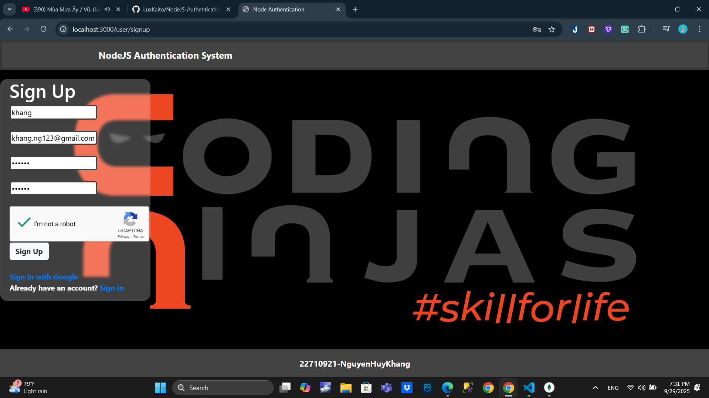
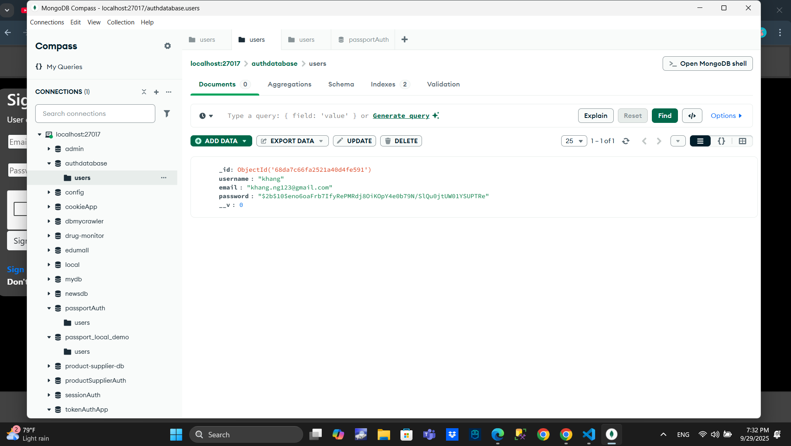
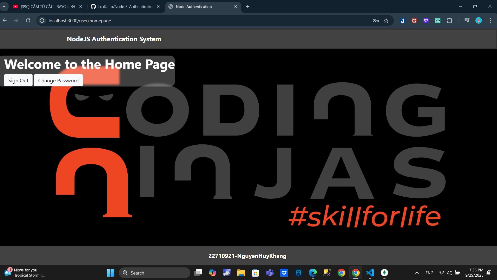
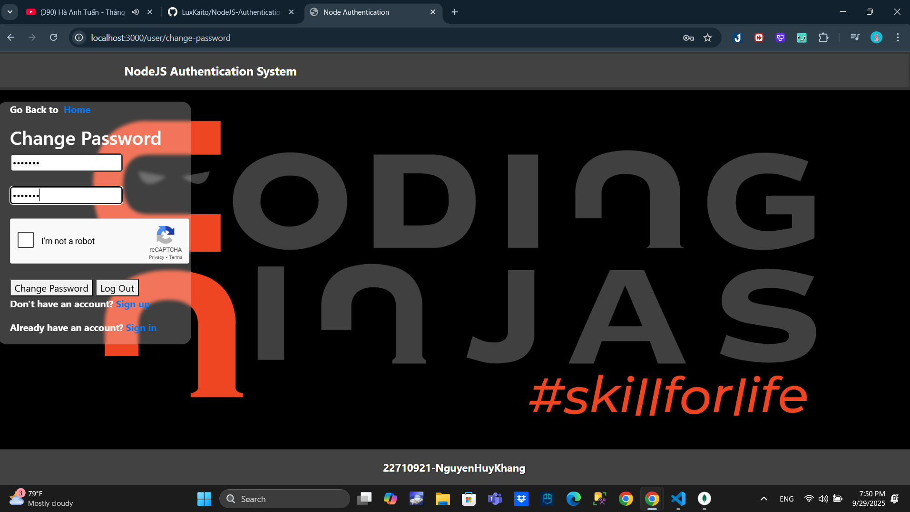
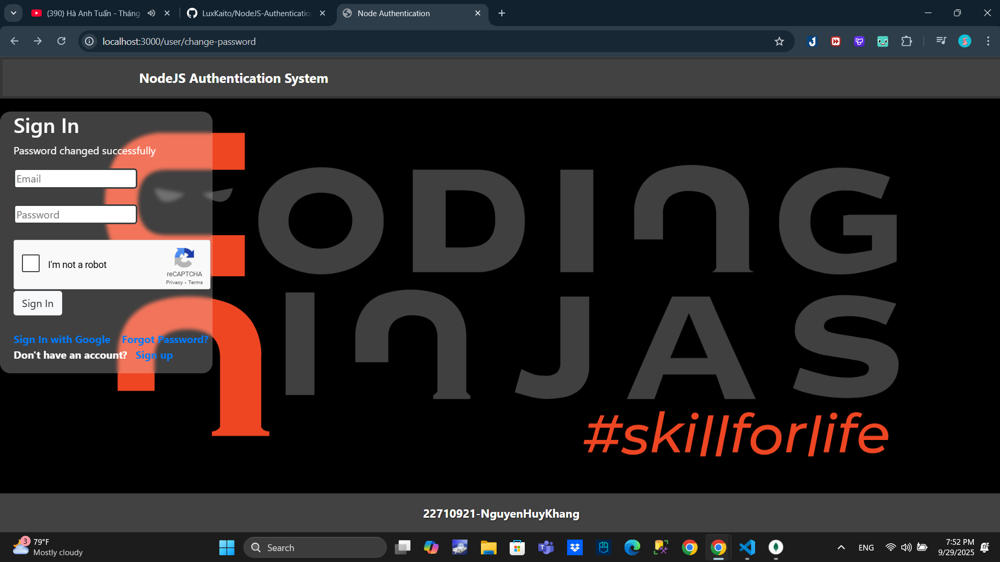
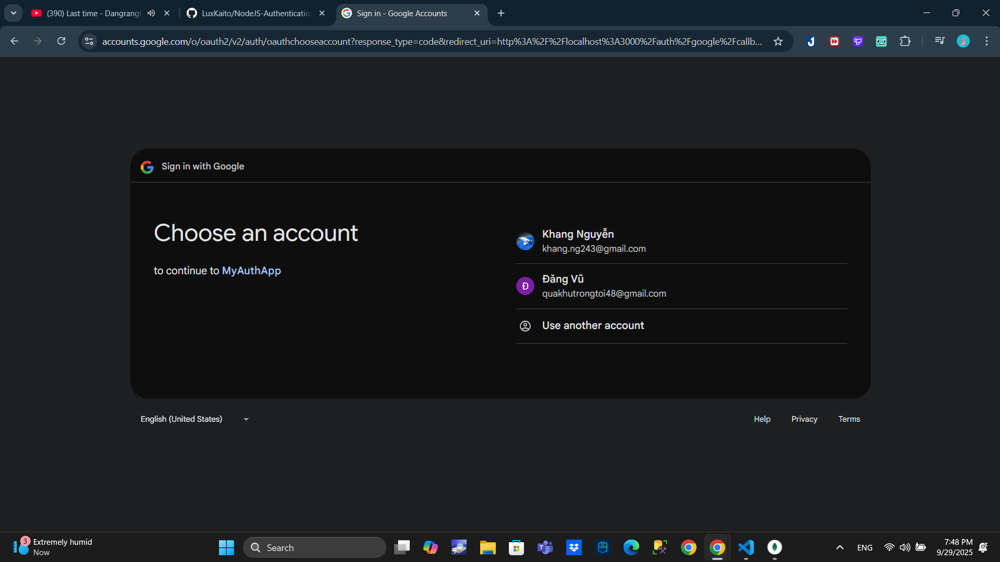
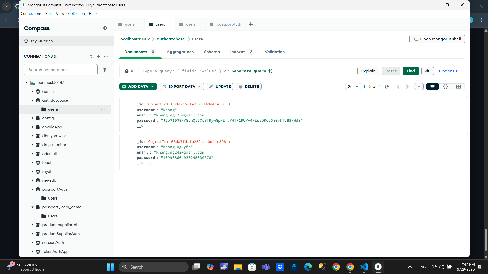
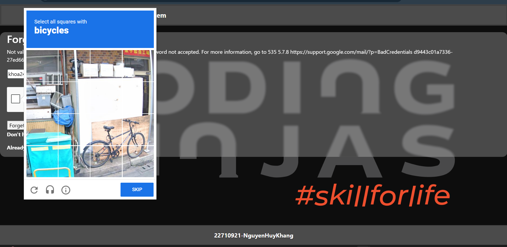

# Node.js Authentication System

This project contains a complete authentication system using Node.js, Express, and MongoDB. It includes features like sign up, sign in, sign out, password reset, and social authentication (Google). The project is structured to be scalable with separate components for models, controllers, and routes.

## Live Site

[Click here](https://nodejs-authentication-system-l2pu.onrender.com/user/signin) to visit the live site.

## Features Implemented

- **Sign-up with Email**  
  
  

- **Sign-in**  
  


- **Reset Password**  
  
  

- **Encrypted Passwords**

- **Google Login/Signup**  
  
  


- **Password Strength Validation**: Notifications are displayed for unmatching passwords during sign up and incorrect passwords during sign in.

- **reCAPTCHA Integration**  
  

## Environment Variables

Before running the application locally, ensure you have set up the following environment variables in a `.env` file located at the root of your project:

```plaintext
PORT=3000
DB_URL=mongodb://localhost:27017/authdatabase
CLIENT_ID=your_client_id
CLIENT_SECRET=your_client_secret
EMAIL=your_email@gmail.com
PASSWORD=your_gmail_password
RECAPTCHA_SECRET_KEY=your_recaptcha_secret_key
CLIENT_URL=http://localhost:3000/auth/login/success
```

## Folder Structure

```
node-authentication/
├── config/                  # Configuration files
│   └── mongodb.js           # MongoDB configuration
├── controllers/             # Controller logic
├── models/                  # Database models
├── routes/                  # Route definitions
├── views/                   # EJS views
├── app.js                   # Express application setup
├── public/                  # Static assets
│   └── img/                 # Feature screenshots
│       ├── signup1.png
│       ├── signup2.png
│       ├── signin.png
│       ├── change_pass1.png
│       ├── change_pass2.png
│       ├── gg_signin1.png
│       ├── gg_signin2.png
│       └── recapcha.png
├── package.json             # NPM package configuration
├── README.md                # Project README file
├── .gitignore               # Git ignore configuration
└── .env                     # Environment variables file
```

## Installation and Setup

Follow these steps to run the project locally:

1. Clone the repository to your local machine:
   ```bash
   git clone https://github.com/your-username/nodejs-authentication-system.git
   ```
2. Navigate into the project directory:
   ```bash
   cd nodejs-authentication-system
   ```
3. Install dependencies:
   ```bash
   npm install
   ```
4. Start the server:
   ```bash
   npm start
   ```
5. Open your web browser and visit [http://localhost:3000](http://localhost:3000) to access the application.

## Dependencies required

- Express.js
- MongoDB
- Passport.js
- bcrypt
- express-session
- express-ejs-layouts
- dotenv
- nodemailer

## Credits

This project was created by [Ravikant Singh](https://github.com/ravikantsingh12). Contributions via issues or pull requests are welcome!

## Follow me on

- [LinkedIn](https://www.linkedin.com/in/ravikant-singh-327a98241)
